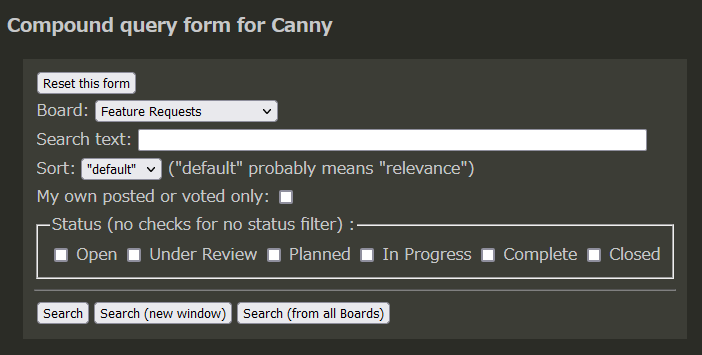
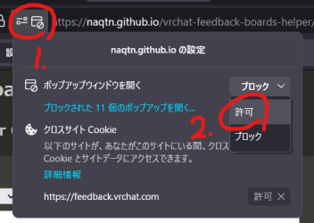

# vrchat-feedback-boards-helper

VRChat が不具合や要望を受け付けている Canny のための、お便利ツール

[https://naqtn.github.io/vrchat-feedback-boards-helper/](https://naqtn.github.io/vrchat-feedback-boards-helper/) で稼働しています。

## これは何？

[VRChat](https://hello.vrchat.com) は  [feedback.vrchat.com](https://feedback.vrchat.com/)
で不具合の報告や機能拡張の要望を受け付けたり、その進行状況を知らせています。
これには [Canny](https://canny.io/ "Canny: Customer Feedback Management Tool") というサービスが使われています。
残念なことに、Canny の一般ユーザ向けの検索機能は限定的で不便です。
それを改善するためにこのちょっとしたツールを作りました。

## 出来ること

このツールは検索フォームを提供し、検索結果を別のブラウザ画面（タブ）に表示します。

このツールでは以下のことが行えます。（別の言い方をすると、Canny の UI ではこれらのことが行えません。）

- 検索文字列と他の条件を一緒に指定すること。（テキストとステータスなどを同時に指定すること）
- ステータスによるフィルターでの複数指定。（いずれかのステータスに該当するものが検索される）
- "Open" や "Closed" 状態の投稿に絞り込むこと。（"Open" は開発からの返答がついていないもの。"Closed" は対応しないとされたもの。）
- 結果順を "old" にすること。（もっとも古いものが先頭に表示される。）
- 検索条件を再利用すること。（検索条件を変更しての再検索。結果を別々のウィンドウに表示して、それらを比較できる。）
- 全ての Board から検索すること。

## 全 Board 検索 "search from all Boards"のための設定

全 Board からの検索機能 "search from all Boards" を使うには、このツールからのポップアップウィンドウを許可する必要があります。
ブラウザーのセキュリティー設定の中にある、ポップアップ・ブロッカーの設定を確認してください。

設定の詳細はお使いのブラウザによりますが、多くの場合以下のように設定するのが簡単です。

1. "search (from all Boards)" ボタンを押す。おそらく一つのウィンドウ（タブ）だけが開かれる。
2. ツールのウィンドウに戻る。ブラウザはツールバーに警告アイコンを表示している。
3. アイコンをクリックして設定ダイアログを開く。
4. 許可を選び、設定する。

### Chrome でのダイアログ:

### Firefox でのダイアログ:

## 制限事項

- 自分が書いた投稿のみを一覧することは出来ません。Canny の検索にその機能がありません。 https://feedback.canny.io/feature-requests/p/show-my-posts https://feedback.canny.io/feature-requests/p/allow-users-to-pull-up-a-list-of-all-the-posts-theyve-made
- Canny はテキストの検索において何らかの曖昧検索をしているようです。完全一致を指定する方法はありません。 https://feedback.canny.io/feature-requests/p/offer-exact-search
- 参考：複数の board からの検索を一画面で行えない、という Canny への機能要求  https://feedback.canny.io/feature-requests/p/global-search-all-boards-to-avoid-duplicates

## 補足資料: Canny の用語

### Sort の選択肢の意味

[Canny help "Board Filters"](https://help.canny.io/en/articles/3827588-board-filters) から引用

> - **Trending**: Sort the board by which posts have gotten the most votes recently. Most activity at the top.
> - **Top**: Sort by raw vote totals. Most votes at the top. Least votes at the bottom.
> - **MRR**: This option will sort posts by total MRR (Monthly Recurring Revenue) value. (NOTE: If multiple users from the same company vote on one post, the MRR value will not increase. The company's value is only counted once per post.) 
> - **Newest**: Sort the board in chronological order, newest posts first.
> - **Oldest**: Sort the board in chronological order, oldest posts first.

私訳

- **Trending**: どの投稿が最近投票をもっとも投じられたかによって順番づける。最も活発だったものが上になる。
- **Top**: 投票総数によって順番づける。最も多く票を集めたものが上に、少なかったものが下になる。
- **MRR**: MRR（Monthly Recurring Revenue、月間経常収益）によって順番づける。（訳省略）
- **Newest**: 時間順で順番づける。最も新しい投稿が先頭になる。
- **Oldest**: 時間順で順番づける。最も古い投稿が先頭になる。

(VRChat は MRR を使っていないようなので、この選択肢はツールでは省いています。)

### Status の意味

[Canny help "Changing the status of a post"](https://help.canny.io/en/articles/673583-changing-the-status-of-a-post) から引用

> - **Open** (No status)
> - **Under Review** (We are considering this)
> - **Planned** (We are planning to work on this)
> - **In Progress** (We are actively working on this)
> - **Complete** (We are done working on this)
> - **Closed** (We will not work on this)

私訳：

- **Open** 特にステータスが付けられていない。（訳補足：投稿直後の状態）
- **Under Review** 検討中
- **Planned** 対応を計画している
- **In Progress** 作業進行中
- **Complete** 作業を完了した
- **Closed** 対応をしない予定

("On Hold" というものも定義されているようですが使っていないようです)
