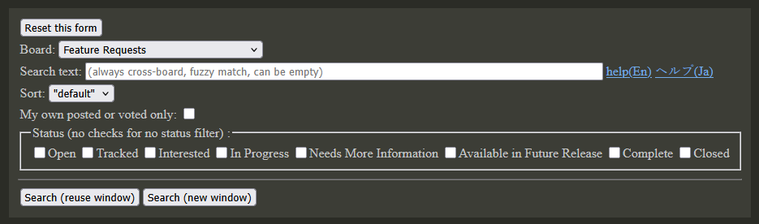

# vrchat-feedback-boards-helper

VRChat が不具合や要望を受け付けている Canny のための、お便利ツール

[https://naqtn.github.io/vrchat-feedback-boards-helper/](https://naqtn.github.io/vrchat-feedback-boards-helper/) で稼働しています。

## これは何？

[VRChat](https://hello.vrchat.com) は  [feedback.vrchat.com](https://feedback.vrchat.com/)
で不具合の報告や機能拡張の要望を受け付けたり、その進行状況を知らせています。
これには [Canny](https://canny.io/ "Canny: Customer Feedback Management Tool") というサービスが使われています。
残念なことに、Canny の一般ユーザ向けの検索機能は限定的で不便です。
それを改善するためにこのちょっとしたツールを作りました。

## 出来ること

このツールは検索フォームを提供し、検索結果を別のブラウザ画面（タブ）に表示します。

このツールでは以下のことが行えます。（別の言い方をすると、Canny の UI ではこれらのことが行えません。）

- 検索文字列と他の条件を一緒に指定すること。（テキストとステータスなどを同時に指定すること）
- ステータスによるフィルターでの複数指定。（いずれかのステータスに該当するものが検索される）
- "Open" や "Closed" などの特定ステータスの投稿に絞り込むこと。（"Open" は投稿直後の状態。"Closed" は VRChat が対応しないとしたもの。）
- 結果順を "old" にすること。（もっとも古いものが先頭に表示される。）
- 検索条件を再利用すること。（検索条件を変更しての再検索。結果を別々のウィンドウに表示して、それらを比較できる。）
- 検索条件を保存し、後で同じ条件で検索すること。

## 検索の挙動について

このツールの検索文字列フィールドを使うと、フォームで選択した Board に関わらず、Canny は **全ての Board** を対象に検索します。選択した Board が結果に効くのは、検索文字列を使わないフィルタのみ（ステータスのみによる絞り込みなど）です。各結果には由来の Board 名が併記されます。

この全 Board 横断の挙動は Canny 側の機能です。技術的詳細は [MAINTAINING.md](MAINTAINING.md) を参照してください。

注意: Canny のトップページにも検索入力欄があり、入力すると `/search?search=...` という URL に遷移しますが、このツールはそのような URL を **使っていません**。その URL を新しいタブで直接開いてもロードが完了しないため使えないからです。このツールは常に `/{board}?search=...` 形式の URL を組み立てて開きます（こちらは確実に動きます）。

## 制限事項

- Canny の "My Own" フィルタ（このツールでは `myCheckbox`）は **「自分の投稿」と「自分が Vote した投稿」の和集合** を返します。「自分の投稿のみ」に絞り込むことはできません。 https://feedback.canny.io/feature-requests/p/show-my-posts https://feedback.canny.io/feature-requests/p/allow-users-to-pull-up-a-list-of-all-the-posts-theyve-made
- Canny はテキストの検索において何らかの曖昧検索をしているようです。完全一致を指定する方法はありません。 https://feedback.canny.io/feature-requests/p/offer-exact-search

## 補足資料: Canny の用語

### Sort の選択肢の意味

[Canny help "Board Filters"](https://help.canny.io/en/articles/3827588-board-filters) から引用

> - **Trending**: Sort the board by which posts have gotten the most votes recently. Most activity at the top.
> - **Top**: Sort by raw vote totals. Most votes at the top. Least votes at the bottom.
> - **MRR**: This option will sort posts by total MRR (Monthly Recurring Revenue) value. (NOTE: If multiple users from the same company vote on one post, the MRR value will not increase. The company's value is only counted once per post.) 
> - **Newest**: Sort the board in chronological order, newest posts first.
> - **Oldest**: Sort the board in chronological order, oldest posts first.

私訳

- **Trending**: どの投稿が最近投票をもっとも投じられたかによって順番づける。最も活発だったものが上になる。
- **Top**: 投票総数によって順番づける。最も多く票を集めたものが上に、少なかったものが下になる。
- **MRR**: MRR（Monthly Recurring Revenue、月間経常収益）によって順番づける。（訳省略）
- **Newest**: 時間順で順番づける。最も新しい投稿が先頭になる。
- **Oldest**: 時間順で順番づける。最も古い投稿が先頭になる。

(VRChat は MRR を使っていないようなので、この選択肢はツールでは省いています。)

### Status の意味

Status は Canny の機能上、利用企業ごとにカスタマイズ可能です。2026-05 現在、VRChat は以下の 8 つの Status を運用しています（Canny の順序通り）:

- **Open** (Initial 型) — 投稿直後の初期状態
- **Tracked** (Active 型) — VRChat が把握している
- **Interested** (Active 型) — VRChat が興味を持っている
- **In Progress** (Active 型) — VRChat が現在作業中
- **Needs More Information** (Active 型) — 投稿者からの追加情報を待っている
- **Available in Future Release** (Complete 型) — open beta の build に実装済み（その open beta のリリースノートに記載されることが多い）。VRChat はこの status を、対応する live 版（通常版）がリリースされた後も維持する傾向があり、必ずしも「未だ live にない」を意味しない。
- **Complete** (Complete 型) — 完了
- **Closed** (Closed 型) — VRChat は対応しない予定

これらの Status とその意味は VRChat の運用次第で変更されることがあります。正確な情報は VRChat 自身のアナウンスを参照してください。Canny の Status システム一般については [Canny help](https://help.canny.io/en/articles/673583-changing-the-status-of-a-post) を参照。
