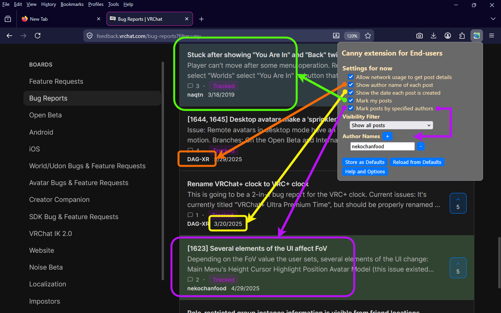
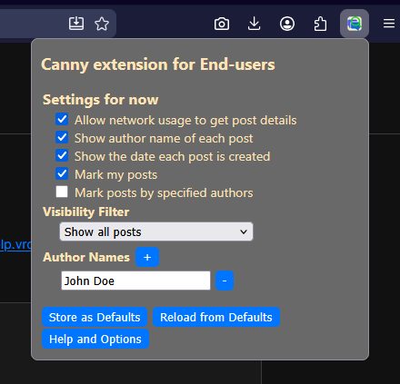

# Canny extension for End-users

[English version](README.md)

[Canny](https://canny.io/) (フィードバック収集サービス) を使ったフィードバックサイトに、パワーユーザー向けの機能を追加するブラウザ拡張

## 概要

この拡張は Canny を使ったフィードバックサイトでのみ動作します。Canny が標準では表示しない情報を投稿一覧に追加したり、選んだ条件に合う投稿に印を付けたり、絞り込み条件に合わない投稿を非表示にすることで、投稿一覧を読みやすくします。

Canny 社自身のフィードバックボードで動きを試せます: <https://feedback.canny.io/>

## 機能

- **各投稿の投稿者名と投稿日を一覧に表示**します。Canny はどちらも標準で表示しないため、誰が・いつ書いたかを一覧で把握しやすくなります。
- **自分の投稿を色付けます。** 背景色を変えて、長い一覧の中で見付け易くします。
- **指定したユーザーの投稿を色付けます。** 自分の投稿への色付けと同じ仕組みを、名前で指定した他のユーザーにも適用できます。
- **Visibility filter (表示フィルタ)**: 自分の投稿だけ、または指定したユーザーの投稿だけの形に絞り込めます。Canny は投稿者による絞り込み機能を提供していないため、その不便を補います。
- **各機能の有効化などの設定値をデバイス内に保存できます。** セッションを越えて保持され、オプション画面またはツールバーのポップアップから設定・適用できます。
- **Dark mode 対応**: Canny が dark mode で表示されているとき、印付けの色も dark mode に馴染む色合いに自動で切り替わります。

## 対応サイト

- 任意の `*.canny.io` サイト (例: `feedback.canny.io`)
- `feedback.vrchat.com` (VRChat の Canny インスタンスの別名)

## インストール

### Chrome / Chromium 系ブラウザ

Chrome ウェブストアからインストールできます:
<https://chromewebstore.google.com/detail/canny-extension-for-end-u/kegipopmleihfiidkcjngbcjoanmceak>

### Firefox

Mozilla Add-ons (AMO) からインストールできます: _1.1.0 の listed-mode 提出が承認され次第、リンクをここに追加します_。

それまでは、ソースから直接インストールする方法が使えます。手順は [MAINTAINING.md](MAINTAINING.md) を参照してください。

### ソースから (開発者・フォーク向け)

[MAINTAINING.md](MAINTAINING.md) を参照してください。

## 使い方

インストール後、Canny のフィードバックサイト (例: <https://feedback.canny.io/feature-requests>) を開いてください。この拡張のアイコン () は最初、ブラウザの拡張機能メニュー (ツールバーのパズルピース型アイコンから開きます) の中に並んだ状態になります。そこにあるこの拡張のアイコンをクリックすると、ポップアップが開きます。素早くアクセスしたい場合は、ブラウザの機能でアイコンをツールバーに直接ピン留めできます。

### 設定

この拡張は設定を 2 つの場所から編集できます。

- **ポップアップ** (ツールバーアイコンから開きます) は、**現在のタブセッション内のみ**有効な設定を編集します。変更は今開いているタブに即座に反映されます。
- **オプション画面** (ポップアップの "Help and Options" ボタンから開きます) は、**新規タブすべてに適用される既定値**を編集します。

設定項目は以下です:

- **Allow network usage to get post details** (詳細取得のためのネットワーク使用を許可): 投稿者と投稿日の情報を取得するために、各投稿の個別ページを fetch するかどうかを制御します。off にすると追加のネットワーク通信を抑制できます。
- **Show author name of each post** (投稿者名を表示): 投稿一覧に投稿者名を追加します。
- **Show the date each post is created** (投稿日を表示): 投稿一覧に投稿日を追加します。
- **Mark my posts** (自分の投稿に印を付ける): 自分が書いた投稿に背景色を付けます。Canny にログインしている必要があります (拡張がどの投稿があなたのものかを判別するため)。
- **Mark posts by specified authors** (指定したユーザーの投稿に印を付ける): リストで指定したユーザーの投稿に、自分の投稿とは別の背景色を付けます。
- **Visibility Filter** (表示フィルタ): "Show all posts" (すべて表示)、"Only posts that I wrote" (自分の投稿のみ)、"Only posts by specified authors" (指定したユーザーの投稿のみ) から選びます。
- **Author Names** (ユーザー名リスト): 上の印付け機能・絞り込み機能で使うユーザー名のリストです。`+` と `-` ボタンで追加・削除できます。

### セッション設定と既定値

- **Store as Defaults** (既定値として保存) ボタンは、現在のセッション設定を新たな既定値として保存します。
- **Reload from Defaults** (既定値から読み戻す) ボタンは、保存されている既定値をセッション設定に読み込みます。

どちらの設定もブラウザのローカルストレージに保存され、外部に送信されることはありません。

## プライバシー

この拡張は、個人データを収集・送信・共有しません。解析やテレメトリのコードも含みません。

プライバシーポリシー全文は [PRIVACY-ja.md](PRIVACY-ja.md) を参照してください。

## ソース・課題管理・ライセンス

- ソースコード: <https://github.com/naqtn/vrchat-feedback-boards-helper>
- Issues (課題管理): <https://github.com/naqtn/vrchat-feedback-boards-helper/issues>
- メンテナーやフォークする方向け: [MAINTAINING.md](MAINTAINING.md)

MIT ライセンスの下で配布しています。

## 注意事項と制限

- この拡張は Canny ページの構造を読み取って情報を抽出しています。Canny がページ構造を大きく変更した場合、拡張が一時的に動作しなくなる可能性があります。
- 投稿の詳細情報を取得するため、投稿ごとに 1 回の追加ネットワーク通信を行います。投稿数の多いボードでは目立つことがあります。「Allow network usage to get post details」を off にすると抑制できます。
- Canny 社自身も別の用途 (admin / team 向け) で公式の[「Canny」 Chrome 拡張](https://chromewebstore.google.com/detail/canny/ppljpoflocngelbkbmebgkpdbbjaejhi)を公開しています。混同しないようご注意ください。

## Canny Inc. とは無関係

この拡張は独立した第三者製の拡張機能です。Canny サービスを運営する [Canny Inc.](https://canny.io/) が制作・推奨・関連しているものではありません。
